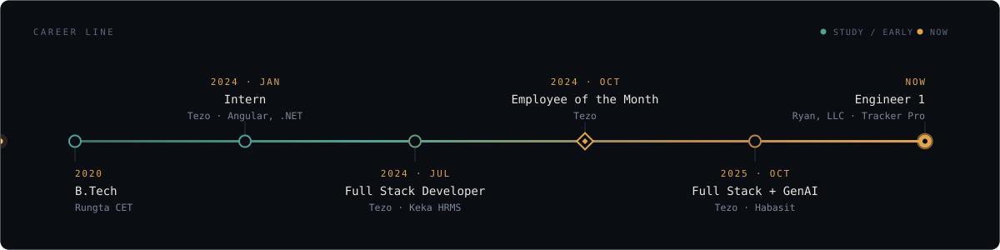
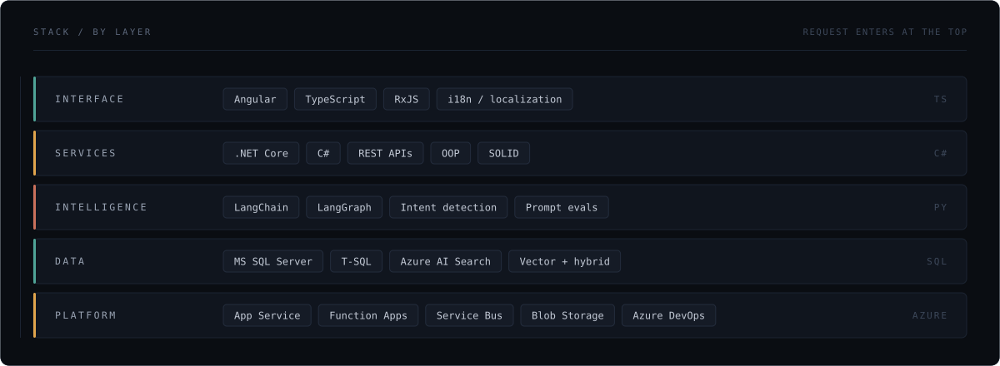

<!--
  arpitmishra04/arpitmishra04 — profile README
  Artwork in ./assets is hand-authored SVG. Edit the SVG source directly;
  it uses system font stacks only, so it renders identically everywhere.
-->

  

  
  
  
  

 

## 01 &nbsp;·&nbsp; Now

I'm an engineer at **Ryan, LLC**, building the **Owner Claims Portal** inside **Tracker Pro** — property tax
software used by the people who file, track and resolve owner claims. Tax workflows are unforgiving: the
data has to survive an audit, and the interface has to stay readable to people who don't think in schemas.

Before this I spent two years at Tezo, first shipping HRMS features for Keka, then moving into GenAI work
for Habasit — where I learned that a language model only counts as a feature once you can put a number on it.

 

## 02 &nbsp;·&nbsp; Track record

| What changed | By how much | Where |
|:--|:--|:--|
| Process turnaround time | down **40%** | Habasit US — fabric belt classification |
| Client escalations | down **28%** | Habasit US — configuration generation |
| Enterprise churn | reduced | Keka — priority features across PODs |
| Employee of the Month | Oct 2024 | Tezo |

<b>Habasit — classification and configuration, owned end to end</b>

 

**Habasit US.** I owned fabric belt classification and the configuration generation that follows from it.
The win wasn't a better prompt — it was adding **prompt validation** and an **evaluation harness** so bad
generations were caught before a human saw them. Process time dropped 40%; escalations dropped 28%.

**Habasit Global.** Same ownership for **Plastic Modular Belt (PMB)**, **HSS**, **CLD** and **ROB**.
Alongside that I worked on a **translation engine** and a **prompt management system**, which turned prompts
from hard-coded strings into versioned, reviewable, testable assets.

What I took from it: an LLM feature isn't done when it produces good output in a demo. It's done when there's
a validation layer in front of it, an eval suite behind it, and a metric someone else can check.

<b>Keka — HRMS at enterprise scale, across three PODs</b>

 

| POD | What I owned |
|:--|:--|
| **Workforce** | Time & attendance in the HRMS, plus **i18n / localization** in Angular. Client tickets on tight SLAs. |
| **RAF** *(Rapid Action Force)* | Priority enterprise features shipped across Keka PODs to pull back accounts at risk of churning. |
| **CoreHR** | Preboarding, onboarding, exits and employee operations — OS defects and RAF delivery for the POD. |

<b>Education and certifications</b>

 

**B.Tech**, Rungta College of Engineering and Technology · 2020–2024
**12th Grade**, O.P. Jindal School, Patrapali (Kharsia Rd) · 2019–2020

DSA Training — Coding Spoon
AWS Academy Graduate — Cloud Foundations
Responsive Web Design — freeCodeCamp
Responsive Website Basics — HTML, CSS and JavaScript

 

## 03 &nbsp;·&nbsp; Stack

Day to day that means C# and .NET Core on the server, Angular and TypeScript on the client, MS SQL Server
underneath, and Azure holding it together. Python, LangChain and LangGraph when the problem needs a model.
Scrum, and enough Azure DevOps to keep a release boring.

 

## 04 &nbsp;·&nbsp; Public work

Most of what I've built belongs to clients and lives in private repositories. These are the public ones —
older, from before Tezo, but they're mine:

- **[WhatsApp Automated Reply](https://github.com/arpitmishra04/Whatsapp-Automated-Reply)** — generates replies to
  incoming WhatsApp messages using the WhatsApp Client API and OpenAI.
- **[User Authentication System](https://github.com/arpitmishra04/User-Authentication-System-Using-Sessions-)** —
  session-based auth with a file upload feature built on the Google API.
- **[Employee Directory](https://github.com/arpitmishra04/EmployeeDirectory)** — C# take on the same problem I'd
  later solve at scale in an actual HRMS.

 

## 05 &nbsp;·&nbsp; Activity

<b>The snake eats my contribution graph</b>

 

<picture>
  <source media="(prefers-color-scheme: dark)" srcset="https://raw.githubusercontent.com/arpitmishra04/arpitmishra04/output/github-contribution-grid-snake-dark.svg" />
  <source media="(prefers-color-scheme: light)" srcset="https://raw.githubusercontent.com/arpitmishra04/arpitmishra04/output/github-contribution-grid-snake.svg" />
  
</picture>

Redrawn twice a day by <a href="./.github/workflows/snake.yml"><code>snake.yml</code></a>.

<b>Trace this profile</b>

 

  

 

---

  
  

Best way to reach me is LinkedIn or email — I answer both.

