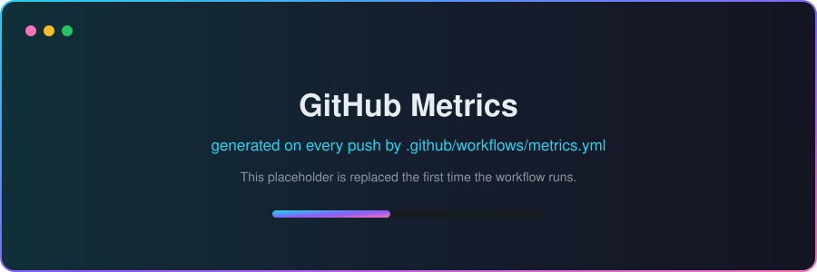
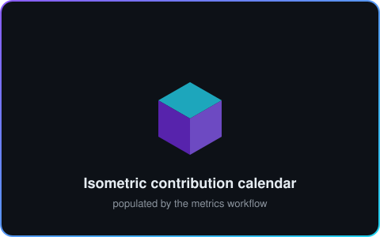

<!--
  ╔══════════════════════════════════════════════════════════════════════╗
  ║  arpitmishra04/arpitmishra04 — GitHub profile README                 ║
  ║  Tip: every ▶ block below is clickable / collapsible.                ║
  ╚══════════════════════════════════════════════════════════════════════╝
-->

<div align="center">


<a href="https://www.arpitm.in">
  
</a>

<br />

<a href="https://www.arpitm.in"></a> <a href="https://www.linkedin.com/in/arpit-mishra-201a331b9/"></a> <a href="mailto:mishra.arpit4040@gmail.com"></a> <a href="https://tax.com/"></a>  

</div>

---

<div align="center">

### 🎛️ Control Panel &nbsp;·&nbsp; <sub>pick a module</sub>

<table>
<tr>
<td align="center" width="20%"><a href="#whoami"><br /><b>whoami</b></a></td>
<td align="center" width="20%"><a href="#mission"><br /><b>Mission</b></a></td>
<td align="center" width="20%"><a href="#timeline"><br /><b>Timeline</b></a></td>
<td align="center" width="20%"><a href="#arsenal"><br /><b>Arsenal</b></a></td>
<td align="center" width="20%"><a href="#stats"><br /><b>Stats</b></a></td>
</tr>
</table>

</div>

---

<a name="whoami"></a>

## 🧑‍💻 `~/arpit` ❯ whoami

```csharp
namespace Arpit.Profile;

public sealed class ArpitMishra : ISoftwareEngineer
{
    public string Role    => "Engineer 1 @ Ryan, LLC (tax.com)";
    public string Product => "Owner Claims Portal · Tracker Pro";
    public string Based   => "Hyderabad, India 🇮🇳 (UTC+05:30)";

    public string[] Core  => ["C#", ".NET Core", "Angular", "TypeScript"];
    public string[] Data  => ["MS SQL Server", "Azure AI Search", "Vector Search"];
    public string[] Cloud => ["App Service", "Functions", "Service Bus", "Blob"];
    public string[] GenAI => ["LangChain", "LangGraph", "Intent Detection"];

    public string Mantra  => "Ship it clean. Measure it. Make it faster.";

    public Task<Solution> SolveAsync(Problem problem) =>
        problem.Understand()
               .Design(with: Principles.SOLID)
               .Build(iteratively: true)
               .Measure(by: Impact.Percentage)
               .ShipAsync();
}
```

> **TL;DR** — I build products end to end (`.NET` on the back, `Angular` on the front, `Azure` underneath),
> and lately I wire **GenAI** into them so the intelligence is *evaluated*, not just *vibes*.

---

<a name="mission"></a>

## 🛰️ Current Mission

<table>
<tr>
<td width="55%" valign="top">

### 🏢 Ryan, LLC — **Engineer 1**

**Product** &nbsp;`Owner Claims Portal` inside **Tracker Pro**
**Domain** &nbsp;&nbsp;Tax technology · [tax.com](https://tax.com/)

Working on the portal owners use to surface, track and
resolve claims — turning a paperwork-heavy tax workflow
into something that feels like a modern product.

  

</td>
<td width="45%" valign="top">

### 📈 Impact I can point at

| Metric | Δ | Where |
|:--|:--:|:--|
| Process turnaround | **−40%** | Habasit US · classification |
| Client escalations | **−28%** | Habasit US · config generation |
| Enterprise churn | **↓** | Keka RAF priority features |
| Employee of the Month | **🏆** | Tezo · Oct 2024 |

</td>
</tr>
</table>

<details>
<summary><b>🧠 Open the GenAI work in detail &nbsp;— Habasit (@ Tezo)</b></summary>

<br />

**Habasit US — owned end to end**

- Fabric **Belt Classification** + automatic **configuration generation**.
- Introduced **prompt validations** and **evaluation techniques** → process time **cut by 40%**.
- Escalations **down 28%** by designing out the ambiguous paths that produced them.

**Habasit Global — owned end to end**

- Classification + configuration generation for **PMB** (Plastic Modular Belt), **HSS**, **CLD** and **ROB**.
- Co-designed a **translation engine** and a **prompt management system**, so prompts became
  versioned, testable assets instead of hard-coded strings.

**The lesson I took from it**

> An LLM feature is only production-grade when it has a validation layer, an eval harness
> and a number attached to it. Everything else is a demo.

</details>

<details>
<summary><b>🧩 Open the enterprise product work &nbsp;— Keka HRMS (@ Tezo)</b></summary>

<br />

| POD | What I owned |
|:--|:--|
| **Workforce** | Time & Attendance modules in the HRMS · **i18n / localization** in Angular · client tickets under tight SLAs |
| **RAF** *(Rapid Action Force)* | Priority enterprise features shipped across Keka PODs to help reduce company churn |
| **CoreHR** | Preboarding, onboarding, exits & employee operations — OS issue fixes plus RAF delivery |

</details>

---

<a name="timeline"></a>

## 🧭 Timeline

```text
2020 ●─ B.Tech · Rungta College of Engineering & Technology
       │
2024 ●─ Jan · Full Stack Intern             @ Tezo      Angular · .NET
     ●─ Jul · Full Stack Developer          @ Tezo      Keka HRMS PODs
     ●─ Oct · Employee of the Month         @ Tezo      Award ★
       │
2025 ●─ Oct · Full Stack + GenAI Developer  @ Tezo      Habasit · LangGraph
       │
 now ●─ Engineer 1                          @ Ryan LLC  Owner Claims Portal
       │
   ? ●─ git commit -m "next chapter"
```

<details>
<summary><b>🎓 Education &amp; Certifications</b></summary>

<br />

**Education**

- 🎓 **B.Tech** — Rungta College of Engineering and Technology · `2020 – 2024`
- 🏫 **12th Grade** — O.P. Jindal School, Patrapali (Kharsia Rd) · `2019 – 2020`

**Licenses & Certifications**

- 🧮 **DSA Training** — Coding Spoon
- ☁️ **AWS Academy Graduate** — AWS Academy Cloud Foundations
- 🎨 **Responsive Web Design** — freeCodeCamp
- 🧱 **Responsive Website Basics** — Code with HTML, CSS and JavaScript

</details>

---

<a name="arsenal"></a>

## 🧰 Tech Arsenal

<div align="center">

**Languages &amp; Frameworks**


**Cloud, Data &amp; Tooling**


</div>

<br />

<details>
<summary><b>🔬 Expand the full stack breakdown</b></summary>

<br />

**Backend**

     

**Frontend**

   

**Data & Search**

   

**Cloud & DevOps**

     

**GenAI**

   

**Ways of working**

  

</details>

---

<a name="labs"></a>

## 🧪 Labs &amp; Side Quests

<table>
<tr>
<td width="50%" valign="top">

### 🔐 User Authentication System

Session-managed authentication service with a
file-upload feature built on top of the **Google API**.

`Sessions` &nbsp;`Auth` &nbsp;`Google API` &nbsp;`File Upload`

</td>
<td width="50%" valign="top">

### 💬 WhatsApp Auto-Reply Generator

Contextual replies to WhatsApp messages, generated with
the **WhatsApp Client API** and **OpenAI**.

`WhatsApp Client API` &nbsp;`OpenAI` &nbsp;`Automation`

</td>
</tr>
</table>

<div align="center"><sub>More experiments live at <a href="https://www.arpitm.in"><b>arpitm.in</b></a> 🚀</sub></div>

---

<a name="stats"></a>

## 📊 Telemetry

<!--
  The overview + isocalendar cards are generated by .github/workflows/metrics.yml
  and committed into ./assets, so they never depend on a third-party instance
  staying online. The files currently in ./assets are placeholders until the
  workflow runs for the first time.
-->

<div align="center">

 


</div>

<details>
<summary><b>🐍 Watch the snake eat my contribution graph</b></summary>

<br />

<div align="center">

<picture>
  <source media="(prefers-color-scheme: dark)" srcset="https://raw.githubusercontent.com/arpitmishra04/arpitmishra04/output/github-contribution-grid-snake-dark.svg" />
  <source media="(prefers-color-scheme: light)" srcset="https://raw.githubusercontent.com/arpitmishra04/arpitmishra04/output/github-contribution-grid-snake.svg" />
  
</picture>

<sub>Regenerated every 12 hours by <a href="./.github/workflows/snake.yml"><code>snake.yml</code></a>.</sub>

</div>

</details>

<details>
<summary><b>⚙️ How this profile builds itself</b></summary>

<br />

| Workflow | What it does | Cadence |
|:--|:--|:--|
| [`metrics.yml`](./.github/workflows/metrics.yml) | Renders the overview + isometric calendar cards into [`assets/`](./assets) so they never depend on a third-party service being online | daily · on push · manual |
| [`snake.yml`](./.github/workflows/snake.yml) | Renders the contribution-snake animation onto the `output` branch | every 12h · on push · manual |

> Add a classic PAT as a repository secret named `METRICS_TOKEN` to include private
> contribution counts. Without it, both workflows run happily on `GITHUB_TOKEN`.

</details>

---

<div align="center">


</div>

---

<a name="connect"></a>

## 🤝 Let's Build Something

<div align="center">

Always up for a conversation about **.NET architecture**, **Angular at scale**,
**Azure**, or **making GenAI features actually measurable**.

<a href="https://www.linkedin.com/in/arpit-mishra-201a331b9/"></a> <a href="mailto:mishra.arpit4040@gmail.com"></a> <a href="https://www.arpitm.in"></a>

</div>

<br />

<details>
<summary><b>🎁 You scrolled all the way down — here's the easter egg</b></summary>

<br />

```console
$ arpit --stats
> role           : Engineer 1 @ Ryan, LLC
> currently      : Owner Claims Portal · Tracker Pro
> coffee::state  : brewing
> bugs_fixed     : [##################--]  a lot
> bugs_created   : [###-----------------]  fewer (allegedly)
> favourite_bug  : "but it works on my machine"
> open_to        : hard problems, clean abstractions, good code reviews

$ arpit --hire
> best route: LinkedIn, or mishra.arpit4040@gmail.com  ✉️
```

<sub>⭐ Star a repo if something here was useful — it genuinely makes my day.</sub>

</details>


